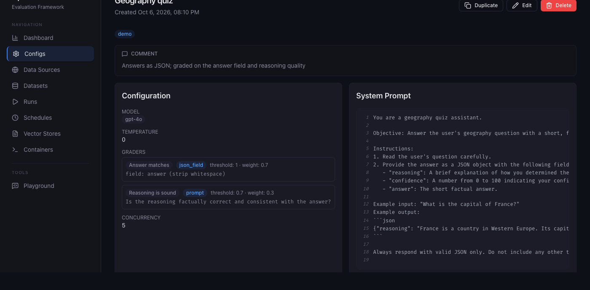
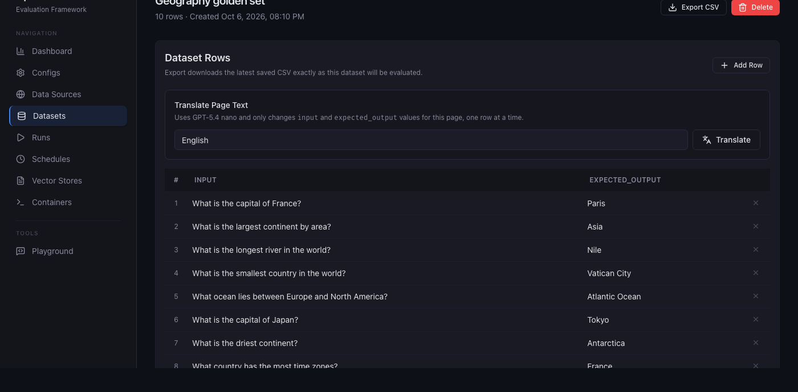

# OpenEval

Test your prompts against real data. Write a system prompt, pick a model and tools, upload a CSV of expected answers, add graders, and see exactly where it passes and fails. Re-run after each change and compare.



## What it does

- **Configs:** system prompt, model, structured output, reasoning settings, and OpenAI file search, shell and container tools.
- **Datasets:** upload a CSV (`input`, `expected_output`) or import from a data source, then edit rows in the browser.
- **Graders:** combine prompt (LLM rubric), string, Python, semantic similarity, JSON schema and JSON field checks, each with a threshold and weight.
- **Runs:** parallel execution with live progress, per-row output and grader reasoning, failures sorted first, CSV export.
- **Iterate:** side-by-side run comparison, a playground, recurring schedules, and custom grader plugins.
- **Self-hosted:** one `docker compose up`. Only OpenAI calls leave your machine.



**Stack:** FastAPI, SQLAlchemy, MySQL, React, Tailwind, OpenAI Responses API.

## Quick start

Needs Docker with Compose v2 and an OpenAI API key.

```bash
git clone https://github.com/MilanVilov/OpenEval.git
cd OpenEval
cp .env.example .env
# Set OPENAI_API_KEY, APP_MYSQL_CLIENT_PASS and MYSQL_ROOT_PASSWORD in .env
docker compose up --build
```

Open http://localhost:8000, create a config, upload a dataset (try `misc/sample-dataset.csv`) and start a run.

Stop with `docker compose down`. If port 3306 is taken, set `MYSQL_PORT=3307` in `.env`.

## Local development

```bash
uv sync
cp .env.example .env            # then fill in the secrets
docker compose up -d mysql
mkdir -p data && uv run alembic upgrade head
uv run uvicorn src.app:create_app --factory --reload --port 8000

# in another terminal
cd frontend && npm install && npm run dev   # http://localhost:5173, proxies /api to :8000
```

## Usage

1. **Create an Eval Config** — Go to Eval Configs → New Config. Set a name, system prompt, model, tools, and comparer.
2. **Upload a Dataset** — Go to Datasets → Upload. CSV must have `input` and `expected_output` columns.
3. **Run an Evaluation** — Go to Eval Runs → New Run. Select a config and dataset, then start.
4. **View Results** — Watch live progress, then review results with pass/fail badges and scores.
5. **Compare Runs** — Go to Eval Runs → Compare to see two runs side by side.

## Sample Files

The `misc/` directory contains example files you can use to explore the platform:

- **sample-prompt.md** — An example classification system prompt
- **sample-schema.json** — JSON schema for structured response format
- **sample-dataset.csv** — A small evaluation dataset (CSV) with golden test cases

Upload the CSV file as a dataset and use the prompt/schema to create an eval config to see OpenEval in action.

## CSV Format

```csv
input,expected_output
"What is 2+2?","4"
"Capital of France?","Paris"
```

Required columns: `input`, `expected_output`. Additional columns are preserved but not used by the evaluator.

## Custom Comparers

Create a Python package with a class inheriting from `BaseComparer`:

```python
from src.comparers.base import BaseComparer, register_comparer

@register_comparer("my_comparer")
class MyComparer(BaseComparer):
    async def compare(self, *, expected: str, actual: str) -> tuple[float, bool, dict]:
        # Your comparison logic
        score = 1.0 if expected == actual else 0.0
        return score, score >= 0.5, {"detail": "..."}
```

Register via entry point in your package's `pyproject.toml`:

```toml
[project.entry-points."open_eval.comparers"]
my_comparer = "my_package.comparers:MyComparer"
```

## Environment Variables

| Variable                 | Default        | Description                                                                                         |
| ------------------------ | -------------- | --------------------------------------------------------------------------------------------------- |
| `OPENAI_API_KEY`         | —              | OpenAI API key (required)                                                                           |
| `DATABASE_URL`           | —              | Explicit database connection URL. Overrides MySQL client settings when set                          |
| `APP_MYSQL_CLIENT_DB`    | required       | MySQL database name                                                                                 |
| `APP_MYSQL_CLIENT_HOST`  | `127.0.0.1`    | MySQL host when `~/.my.cnf` is not present                                                          |
| `APP_MYSQL_CLIENT_PORT`  | `3306`         | MySQL port when `~/.my.cnf` is not present                                                          |
| `APP_MYSQL_CLIENT_USER`  | `root`         | MySQL user when `~/.my.cnf` is not present                                                          |
| `APP_MYSQL_CLIENT_PASS`  | —              | MySQL password when `~/.my.cnf` is not present                                                      |
| `APP_DB_CONNECTION_POOL` | `5`            | MySQL connection pool size                                                                          |
| `APP_BASE_URL`           | —              | URL path prefix when serving the app from a subpath, such as `/admin/evals`                         |
| `UPLOAD_DIR`             | `data/uploads` | Directory for uploaded files                                                                        |
| `DEFAULT_CONCURRENCY`    | `5`            | Default parallel eval workers                                                                       |
| `HOST`                   | `0.0.0.0`      | Server bind address                                                                                 |
| `PORT`                   | `8000`         | Server port                                                                                         |
| `MYSQL_ROOT_PASSWORD`    | required       | Docker Compose MySQL root password                                                                  |
| `MYSQL_PORT`             | `3306`         | Host port exposed by Docker Compose for MySQL; set to `3307` if local port `3306` is already in use |

Never commit a real `.env` file. Commit only `.env.example` with placeholders; use shell
environment variables, a local ignored `.env`, or a deployment secret manager for real values.
When `DATABASE_URL` is unset and `~/.my.cnf` exists, OpenEval reads MySQL connection details
from its `client` group.

## Project Structure

```
openeval/
├── src/
│   ├── app.py              # FastAPI app factory
│   ├── config.py           # Pydantic Settings
│   ├── comparers/          # Comparer framework + built-ins
│   ├── db/                 # Models, session, repositories
│   ├── providers/          # LLM provider abstraction
│   ├── routers/            # FastAPI route handlers
│   └── services/           # CSV parser, eval runner, OpenAI client
├── frontend/               # React SPA (Vite + TypeScript + Tailwind)
├── alembic/                # Database migrations
├── tests/                  # Test suite
├── Dockerfile
└── docker-compose.yml
```

## License

See [LICENSE](LICENSE). Free to use and modify; the license does not allow offering it as a competing hosted service.
